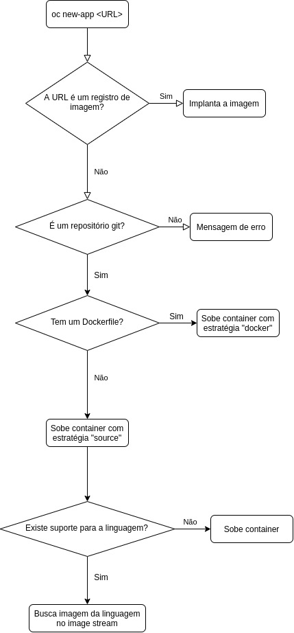

<p align="center"><a href="../aula02">Próxima aula ❯</a></p>
<br/>

# Aula 1 - Criando uma aplicação a partir de uma imagem
Bem-vindo ao capítulo 3 do curso de OpenShift! Nesta aula, implantaremos uma aplicação simples no OpenShift usando uma imagem pré-compilada e hospedada num repositório.

## Estratégias de compilação
Para criar uma aplicação, usamos o comando `oc new-app`. Ele suporta uma série de comandos diferentes para diversos tipos de operações diferentes, incluindo a estratégia usada para compilar e implantar sua aplicação. O OCP suporta uma série de estratégias para implantar sua aplicação, e uma delas é a partir de um registro de imagens, buscando uma imagem já compilada e a implantando. Ao criarmos uma aplicação sem fornecer a estratégia específica, o OpenShift faz uma checagem. Ele determina como a aplicação será criada a partir de um fluxo pré-definido.

A primeira coisa a se fazer é checar se a URL fornecida é um registro de imagens, e, caso seja, a aplicação é implantada a partir da imagem. A segunda verificação é se a URL é um repositório Git. Caso não seja, a operação é cancelada. Caso seja, o OpenShift verifica se dentro do repositório existe um Dockerfile, e, caso positivo, a imagem é compilada e implantada. Mas, caso não existe um Dockerfile, e sim arquivos que identificam uma linguagem, a estratégia S2I (source-to-image) é ativada e a aplicação é compilada a partir do código. Caso nenhuma das tentativas anteriores funcione, um fluxo de imagem é buscado para a implantação da imagem. Um erro é exibido caso todas as tentativas falhem.

<figure>
  
  <figcaption>Imagem 1.1 - O fluxo do comando de criação de aplicações</figcaption>
</figure>

## Criando uma imagem para o OpenShift
Criar uma imagem para o OpenShift segue o mesmo processo de criação, mas com algumas particularidades referentes a permissões. Ao contrário de containers convencionais executando no Docker ou no Podman, que normalmente sobem utilizando o usuário root, no OpenShift precisamos tratar disso. E, claro, levando em consideração a quantidade de camadas numa imagem, que precisa ser a menor possível para que tenhamos performance superior e uma imagem mais leve.

Por padrão, não podemos usar o usuário root, e também não podemos criar um usuário específico. O OpenShift utiliza um usuário aleatório para cada implantação feita, e nossa imagem precisa estar pronta para isso. Seja utilizando a estratégia Docker, que compila uma imagem a partir de um Dockerfile, seja a estratégia de imagem, que é a que esta aula vai tratar. Em ambos os casos, um usuário aleatório será utilizado para subir a aplicação.

Os arquivos e diretórios necessários para execução da aplicação deverão ser propriedade do grupo de id `0`, isto é, `root`. O usuário proprietário dos arquivos e pastas deverá ser um usuário sem nome, com ID aleatório **maior** que `1000`. Isso se deve por causa de uma diretiva do Unix (e Linux), que preserva usuários com IDs de 100 a 499 para uso dinâmico do sistema. Em algumas distribuições como Debian, Ubuntu e FreeBSD, esses número aumenta para 999. Por isso a recomendação de usar números maiores que 1000: evita problemas com qualquer distribuição Unix que o desenvovledor resolva usar. O comum é usar o ID `1001` para isso.

Você pode utilizar Dockerfiles ou até mesmo o Buildah por linha de comando para criar sua imagem OpenShift. A parte importante é as permissões serem definidas corretamente. 

```Dockerfile
RUN yum update -y && \
    yum upgrade -y && \
    yum install -y wget tar git && \
    git clone https://github.com/usuario/repositorio.git && \
    wget https://downloads.apache.org/maven/maven-3/3.6.3/binaries/apache-maven-3.6.3-bin.tar.gz && \
    wget https://download.java.net/java/GA/jdk11/9/GPL/openjdk-11.0.2_linux-x64_bin.tar.gz && \
    tar xvzf apache-maven-3.6.3-bin.tar.gz && \
    tar xvzf openjdk-11.0.2_linux-x64_bin.tar.gz && \
    chmod -R +x $MAVEN_HOME/bin && \
    chmod -R +x $JAVA_HOME/bin && \
    mkdir /.m2 && \
    $MAVEN_HOME/bin/mvn clean install -f /opt/repositorio/pom.xml
```
Este trecho de Dockerfile, por exemplo, executa comandos importantes para que uma aplicação Java execute num container. Mas note que nada além da permissão de execução nos binários do Maven e do Java é feito. Para o OpenShift, é necessário também definir permissões nos arquivos da aplicação, recursivamente. No caso do Maven, também é importante que o usuário aleatório possa escrever em `/.m2`, pois é onde o Maven baixa as dependências da aplicação.

As permissões no caso precisam ser iguais para usuário de grupo, e os arquivos precisam ser permissão do grupo `0`, que, como citado anteriormente, é o grupo `root`. A permissão de usuário precisa ser para o usuário com o ID aleatório, e para exemplos usaremos `1001`.

```Dockerfile
RUN yum update -y && \
    yum upgrade -y && \
    yum install -y wget tar git && \
    git clone https://github.com/usuario/repositorio.git && \
    wget https://downloads.apache.org/maven/maven-3/3.6.3/binaries/apache-maven-3.6.3-bin.tar.gz && \
    wget https://download.java.net/java/GA/jdk11/9/GPL/openjdk-11.0.2_linux-x64_bin.tar.gz && \
    tar xvzf apache-maven-3.6.3-bin.tar.gz && \
    tar xvzf openjdk-11.0.2_linux-x64_bin.tar.gz && \
    chmod -R +x $MAVEN_HOME/bin && \
    chmod -R +x $JAVA_HOME/bin && \
    mkdir /.m2 && \
    chmod g=u -R /opt/repositorio /.m2 && \
    chown 1001:0 -R /opt/repositorio /.m2 && \
    $MAVEN_HOME/bin/mvn clean install -f /opt/repositorio/pom.xml
```

Note que neste outro trecho de Dockerfile, definimos a permissão para o usuário aleatório e o grupo root. Definimos, também, que o grupo proprietário de tudo dentro do diretório deve ter as mesmas permissões do usuário proprietário. Esta ordem de permissões precisa ser recursiva, pois o usuário executor precisa de acesso a tudo que diz respeito à aplicação. Também definimos as mesmas permissões na pasta que o Maven usa para suas dependências. Assim nos certificamos que quando a aplicação for compilada, não teremos problemas com o usuário escrevendo naquela pasta.

Com a permissão corrigida, temos que dizer quem será o executor. Em Dockerfiles, isso é feito com o comando `USER`. Usa-se o mesmo ID de usuário definido anteriormente. É importante notar que o arquivo de entrypoint também precisa ser de permissão do usuário e do grupo root. No caso do exemplo acima, assuma que o entrypoint fora copiado para a pasta `/opt` antes do comando `RUN` ser chamado. Independente de onde o arquivo de entrypoint estiver, estas mesmas permissões precisam ser passadas para ele. Por isso é recomendável manter o entrypoint no mesmo diretório onde a aplicação se encontra. Assim, apenas uma definição de permissão é necessária. 

```Dockerfile
USER 1001
ENTRYPOINT [ "sh", "/opt/entrypoint.sh" ]
```

## Criando uma aplicação
Com a imagem necessária já hospedada num repositório de imagens, podemos prosseguir com a criação da aplicação no OpenShift. A primeira coisa a se fazer é o login, obviamente. 

```bash
oc login -p nome_de_usuario https://api.seucluster.com:6443
```

Este comando faz o login no console fornecido com o nome de usuário fornecido, e pede a senha em seguida. Você pode também usar o flag `-p` para fornecer a senha ainda na linha de comando, apesar de isso deixar a sua senha à mostra em texto pleno. Por isso, recomendo que faça o login somente com usuário e digite a senha quando pedida.

Por padrão, quando o usuário logado não tem nenhum projeto vinculado a ele, o OpenShift o vincula ao projeto `default`. Para nossa aplicação, vamos precisar de um projeto. Para isso, usamos o comando `new-project`.

```bash
oc new-project meu-projeto
```

Muitas vezes utilizamos repositório públicos, mas por vezes pode ser que a imagem que precisamos seja privada. Nesses casos, é necessário fornecer os dados do usuário que efetuará o pull da imagem no repositório para o OpenShift utilizá-lo. Existem duas formas de fazer isso: utilizando o arquivo de token gerado pelo Docker ou Podman ao fazer login num repositório ou por usuário e senha diretamente.

```bash
# Utilizando o arquivo de token
oc create secret generic quayio \
    --from-file=.dockerconfigjson=<path/to/.docker/config.json> \
    --type=kubernetes.io/dockerconfigjson

# Utilizando usuário e senha
oc create secret docker-registry quayio \
  --docker-username=nome_de_usuario \
  --docker-password=senha_do_usuario \
  --docker-server=quay.io
```

É necessário fazer apenas um dos comandos acima, pois ambos tem a mesma finalidade. Note que em sistemas Windows, o caminho onde o Docker guarda este arquivo pode variar. Consulte a documentação do Docker para saber onde arquivos de identidade são guardados no Windows. Caso não seja possível, talvez seja mais prático utilizar o segundo método.

Ao criar um segredo com os dados do repositório, é necessário dizer ao OpenShift que o segredo criado se trata de credenciais de um repositório. Para isso, usa-se o comando `oc secrets link` e passa-se como argumento a permissão de pull.

```bash
oc secrets link default quayio --for pull
```

Com as credenciais importadas, o desenvolvedor já será capaz de importar imagens do repositório fornecido. Como explicado nas aulas anteriores, o OpenShift usa fluxos de imagem para cadastrar rotas de imagens e tags usadas pelas aplicações. Para que nossa aplicação seja usada, precisamos de um fluxo de imagem apontando para o repositório onde ela de fato se encontra. Podemos fazer isso de duas formas: importando a imagem e depois usando o fluxo de imagem para criar uma aplicação ou fornecer o caminho da imagem como argumento da criação da aplicação. Em ambos os casos, um fluxo de imagem é criado. 

### Criando por importação
```bash
# Importando a imagem
oc import-image minha-imagem:1.0 --from docker.io/seu_usuario/minha-aplicacao --confirm
```

Este comando cria um fluxo de imagem chamado `minha-imagem`, com uma tag `1.0`. Esta tag do fluxo de imagem aponta para o repositório `docker.io/seu_usuario/minha-aplicacao`. Ou seja, a tag do fluxo de imagem do OpenShift estará vinculada à tag `latest` da imagem real. Quando utilizarmos este fluxo de imagem com esta tag, o OpenShift se referenciará àquele endereço para baixar a imagem fornecida. Podemos criar a aplicação usando o seguinte comando:

```bash
oc new-app --name minha-aplicacao -i minha-imagem:1.0
```

Este comando recebe o flag `-i`, que serve para buscar um fluxo de imagem do seu projeto. Pode-se trocar este flag por `--image-stream`, que tem a mesma função. Utilizando este comando, sua aplicação será criada usando a imagem `docker.io/seu_usuario/minha-aplicacao`, registrada internamente no seu OpenShift como `minha-imagem:1.0`.

### Criando pelo URL da imagem
Podemos também criar a aplicação diretamente pelo comando `oc new-app`, fornecendo apenas o URL de onde a imagem se encontra. Leve em consideração o desenho da imagem 1.1. Mas, por fins de confirmação, usaremos flags de estratégia para todas as criações de aplicações. Simplesmente passar o link sem fornecer uma estratégia pode acarretar em problemas caso seu repositório tenha ambos código e Dockerfile, ou caso a imagem de compilação para a linguagem do seu repositório não exista. Para evitar problemas, a recomendação é sempre fornecer a estratégia junto do comando, como quando usamos `--image-stream` no exemplo anterior.

```bash
oc new-app --name --docker-image docker.io/seu_usuario/minha-aplicacao
```

Este comando cria a sua aplicação baseada na imagem fornecida. Um fluxo de imagem também é criado. A diferença de fazer desta forma e da outra é a flexibilização do seu fluxo de imagem. Criar por importação permite que seu fluxo de imagem seja mais personalizado e use tags específicas. No caso do comando acima, o fluxo terá o mesmo nome e tag da imagem fornecida. 

## Acompanhando a implantação
Entre as diferenças do OCP 4.5 está a criação de configurações de implantação. Em versões anteriores, a criação era automática junto com as aplicações, mas isso foi alterado, e agora é necessário fornecer um flag para isso. Caso o flag não seja fornecido, aplicações criadas a partir de uma imagem terão somente implantações, mas não configurações de implantação. Usamos o flag `--as-deployment-config`. 

Para acompanhar o log dos pods, primeiro precisamos ter acesso a eles. Usa-se o comando `oc get pod` para listar os pods existentes. O flag `-w` deste comando mantém a lista de pods atualizada. Apesar disso, para fins de organização, recomenda-se usar o comando `watch` para listar os pods e manter a lista atualizada, pois fica mais fácil de ler.

```bash
# Listando pods
oc get pod
NAME                  READY   STATUS             RESTARTS   AGE
simplecrud-1-deploy   1/1     Running            0          2m48s
simplecrud-1-mjnr4    0/1     CrashLoopBackOff   4          2m39s

# Listando pods e mantendo atualização com flag
oc get pod -w
NAME                  READY   STATUS             RESTARTS   AGE
simplecrud-1-deploy   1/1     Running            0          3m5s
simplecrud-1-mjnr4    0/1     CrashLoopBackOff   4          2m56s
simplecrud-1-mjnr4    0/1     Error              5          3m36s
simplecrud-1-mjnr4    0/1     CrashLoopBackOff   5          3m47s
simplecrud-1-mjnr4    1/1     Running            6          6m31s
simplecrud-1-mjnr4    0/1     Error              6          6m32s
simplecrud-1-deploy   0/1     Completed          0          6m41s
simplecrud-1-mjnr4    0/1     CrashLoopBackOff   6          6m45s


# Listando pods e mantendo atualização com watch
watch -n 0.5 oc get pod
NAME                  READY   STATUS             RESTARTS   AGE
simplecrud-1-deploy   1/1     Running            0          2m48s
simplecrud-1-mjnr4    0/1     CrashLoopBackOff   4          2m39s
```

Usar o comando `watch` permite parametrizar o tempo, sempre calculado em segundos. O comando acima atualiza a lista a cada meio segundo. Para acompanhar a última implantação, usamos o comando `oc logs`. O switch `-f` mantém o log em buffer, sendo sempre atualizado.

```bash
# Logs da segunda implantação da aplicação
oc logs -f aplicacao-2-deploy

# Logs da implantação mais nova (é necessário que exista uma configuração de implantação)
oc logs -f dc/aplicacao
```

## Controlando pods
Este passo é feito pela interface web do OpenShift. Acesse a console do OpenShift e faça login. Na barra lateral, selecione Home > Projects, e depois clique no nome do projeto que criamos. Em seguida, novamente na barra lateral, selecione Workloads > Deployment Configs, e selecione a configuração de implantação da aplicação que criamos.

Ao término do carregamento da página, um círculo será exibido com a quantidade de pods em execução, sendo possível escalar de 0 a N. Ao aumentarmos, o OpenShift implanta novos clones da aplicação, o que aumenta a disponibilidade dela - e, consequentemente, o uso de recursos.

## Referências
* [Documentação do OpenShift](https://docs.openshift.com/)
* [Trabalhando com projetos](https://docs.openshift.com/container-platform/4.5/applications/projects/working-with-projects.html)
* [Criação de aplicações](https://docs.openshift.com/container-platform/4.5/applications/application_life_cycle_management/odc-creating-applications-using-developer-perspective.html)
* [Criando aplicações com o CLI](https://docs.openshift.com/container-platform/4.5/applications/application_life_cycle_management/creating-applications-using-cli.html)
* [Mapas de configuração](https://docs.openshift.com/container-platform/4.5/builds/builds-configmaps.html)
* [Entendendo implantações e configurações de implantação](https://docs.openshift.com/container-platform/4.5/applications/deployments/what-deployments-are.html)
* [Estratégias de implantação](https://docs.openshift.com/container-platform/4.5/applications/deployments/deployment-strategies.html)

----
<p align="center"><a href="../aula02">Próxima aula ❯</a></p>